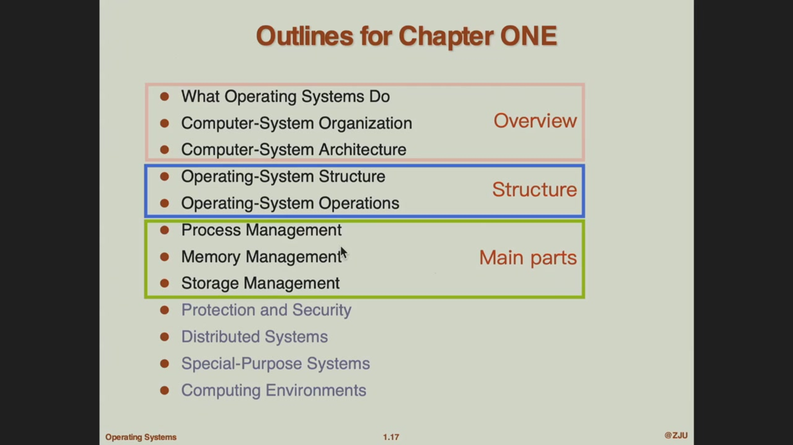
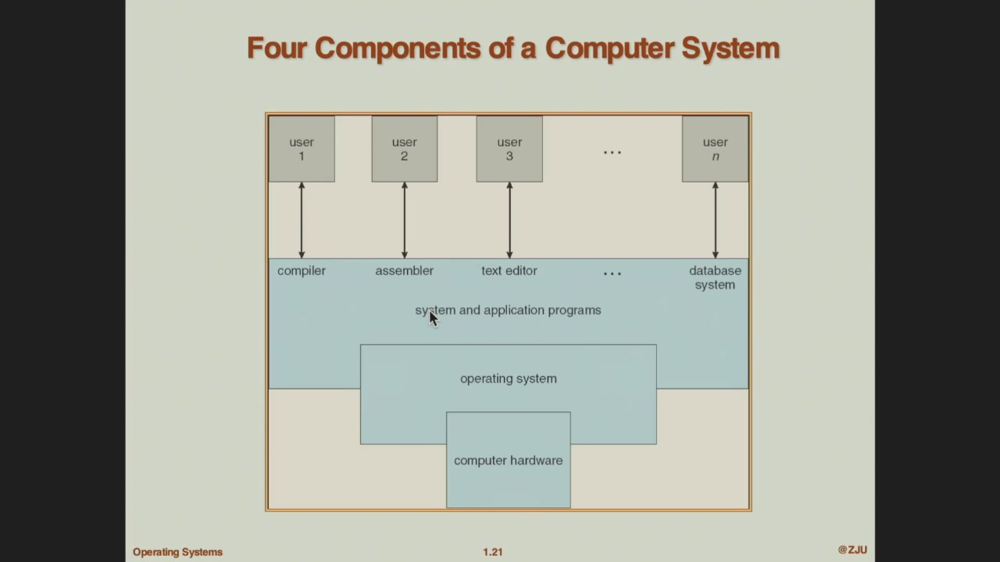
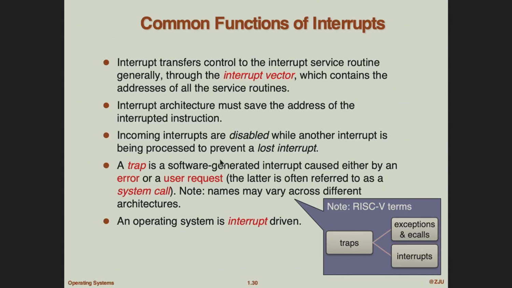

- [1 Intro](#1-intro)
  - [课程介绍](#课程介绍)
  - [正式内容](#正式内容)

## 1 Intro

### 课程介绍

Q: 为什么还要学操作系统？ A: 在现代摩尔定律（处理器性能每十八个月会翻一倍）逐渐失效后，软件优化/算法设计还能够提供可观的性能提升，因而处于软硬之间的操作系统就尤为重要。

操作系统分为四块：进程管理/内存管理/存储管理/IO管理。

学习材料：一本有了的教材，《边干边学 Linux 内核指导》，和[xv6](https://pdos.csail.mit.edu/6.1810/2022/xv6.html)

评分：
- final 50%，
- hw： 5%，
- quiz： 5%
- lab：40%，报告和验收对半分。

所有的实验都是相同的，一共六组。前三个比较简单，中间三个两人完成。最后一个实验bonus。

### 正式内容
outline:

操作系统能
- 简化程序运行/纠错
- 避免和硬件直接打交道。比如编写一个程序，如何分配内存，加载程序，运行等等。这些与硬件相关的内容全部由操作系统执行。

操作系统是计算机系统结构四部分之一，这四个结构是：
- 硬件：提供基础的计算/存储设备；
- OS：掌控硬件资源，并追踪各个程序对硬件资源的使用情况。
- 系统/应用程序：定义资源使用方式，解决用户计算任务。
  - > 系统与应用程序指的是计算机系统中用于定义资源使用方式并解决用户计算问题的软件。它们包括系统程序和应用程序两类，其中系统程序是直接支持计算机运行和管理的核心软件。
    > 系统程序主要包括操作系统本身及其相关工具，负责管理和分配硬件资源（如 CPU、内存、I/O 设备），并提供用户与硬件之间的接口。例如，文件管理系统、设备驱动程序和实用工具（如磁盘格式化工具）都属于系统程序。这些程序确保计算机系统稳定运行，并为应用程序提供支持环境，帮助用户更有效地完成任务。
    > 应用程序（如文字处理器、编译器、网页浏览器）则是基于系统程序构建的，专门为用户解决特定计算问题，提供直接的功能支持。简单来说，系统程序是基础支撑，应用程序是面向用户需求的扩展。
- 用户：home下的各个用户。

  
那么什么是OS呢，从实际作用来说，OS负责
- 分配资源，处理资源利用上的冲突，实现高效的资源利用。
- 管理各个程序的执行，避免恶意程序破坏计算机系统。

目前对于OS还没有正式的定义。我们一般认为其中核心的部分（称为kernel，之后会介绍）为真正的OS。

那么，kernel又是如何被加载/运行的呢？这来源于 bootstrap program，这个program存储在ROM/EPROM 中（也被称为 firmware/固件），它会初始化各种需要用到的硬件资源（包括检测各种资源是否正常），然后加载/执行操作系统内核，为用户的使用做准备。

一个计算机系统有很多组件，除了CPU，内存以外还有各个外设，比如磁盘，键鼠，打印机和显示器。这些外设与内设之间通过bus连接，共享信道。因此他们之间会有资源冲突。比如对bus的控制，对CPU的控制等等。因此操作系统就要能很好的处理这些工具的请求。

每一个设备都有一个device controller来管理设备，controller内置一个local buffer。local buffer和设备之间通过io传信，CPU和local buffer之间通过bus通信。每当io结束，controller就会通过bus发起一个interrupt/中断来通知CPU。

不同设备的中断由cpu的中断控制器来处理，一个典型的可编程中断控制器是8259。

这里CPU通过INTR（中断请求线）和INTA（中断确认线）与8259通信，8位数据总线（Data Bus）用于传输控制/状态信息和中断向量；8259接收IR0-IR7（8个中断请求输入线），这些线连接到设备控制器（如之前讨论的I/O设备控制器），用于捕获中断信号。8259内部包含优先级解析器、寄存器组等模块，实现可编程配置。

中断有很多作用

操作系统有对应的中断处理逻辑，简单来说，就是保留当前的运行状态，比如数据/函数栈/指针等等，而后接着处理中断，比如检查中断的具体信息，并作出响应。

一个常见的中断情景是io，io处理有两种模式

io 还可以使用 DMA 加速。

存储，多级存储，以及多核系统，内存一致等等。这些内容在体系结构中讲了不少。

进程：进行中的程序，而program（程序）只是一个‘序’，不执行的时候就跟普通的文件没什么区别，program只是定义了运行时的各种操作以及所需要的数据。

process 需要硬件资源，单线程进程有一个program counter，记录‘序’在哪里；多线程进程中每一个线程都有一个program counter，好像一个浏览器中打开的不同的窗口。

