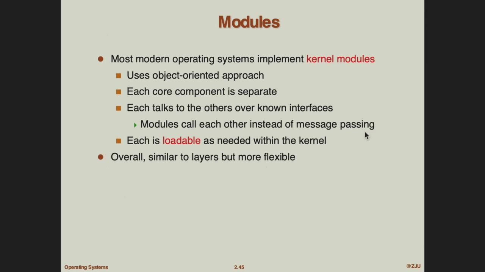

# course 2
## outline

## OS Services
目的是让 **用户** 和 **OS** 本身更好地使用计算机。

- for user
  - 各种 UI（GUI/CLI/touch screen）
  - 执行程序
  - IO 操作
  - 文件系统
  - 网络通信
  - 检测错误：环境错误、程序运行错误等等。
- for OS
  - 分配资源
  - 记录资源使用情况（accounting，记账）
  - protection/security。

操作系统提供了cli接口供用户使用，可以内置在kernel中，也可以作为system program。它能执行各种各样设计好的命令，这些命令可以是内置的（比如cmd），可以是许多的小程序的name（bash）。

## OS call
以上Service会实现成为system call。system call就是OS提供的PI，一般用c/c++写。直接的sc还是太抽象了，因为它还是接近底层。有很多基于sc的api，更易用，更可移植，比如win32api，posix api和java api。

每个sc都有一个id，由system call interface管理。同时sci负责代理用户程序调用sc，并返回运行结果，因此caller（user program）不知道执行过程，只需要调用sci的api，便可得到结果。许多runtime support library（rts）就是这样，在运行时提供对OS资源的访问，并且程序员无需直接操作内核。

### si parameters passing
sc 需要不少参数。比如要执行的是什么sc，相关的参数有多少/在哪里等等。

传参的三个方式
- registers（传寄存器）
- parameters stored in a block/table in memory，then use address of the block as a parameter.（传地址）
- 栈参数。
## types of si
- 进程控制相关：fork/wait/exit
- 文件相关：open/read/write/close
- 文件权限：chmod/umask/chown
- 设备相关：ioctl/read/write
- 获取信息：getpid
- 通信：pipe等

## system program
sp provide a convenient environment for program development and execution.
比如各种sh的命令，perf/gdb，编译器、链接器。这种层面的东西就可以称为sp。

系统程序侧重于系统管理和资源访问。

# course 3
## OS design/implementation
没有统一的设计/实现思路，但是有一些实际的设计方法。

从需求出发：
- 用户希望：方便、安全；
- 系统要：高效、灵活。

**the seperation of policy and mechanism**:
两个内容：
- policy：what will be done
- mechanism: how to do it.

## 一些 OS
- dos:msdos能在最小的空间上提供尽可能多的功能，它的各个功能之间耦合的比较紧密，没有分模块。但有一定的分层。
- unix
  - system program+kernel
  - 
  - 它的内核真的很大，因此叫做宏内核
- 微内核：把核心东西留下来，可插拔的东西（文件系统/IO）放在内核外面，就减小了内核体积。
  - 可扩展性/可移植性/安全
  - 通信开销/性能下降。
- mixed
  - 比如Mac OS X Structure，由微内核mach+BSD+kernel env（一层接口）组成。BSD 是 Unix 的一个版本。
- 模块化内核：我认为就是把内核分成了多个模块，本质上和之前的核区别不大。
  - 
  - 比如Solaris
- 其他的kernel
  - exokernel
    - 
  - unikernel
    - 

## VM
虚拟只有一个系统（host），称为宿主系统；装上一个支持虚拟机的软件（称为hypervisor），就可以装想要的操作系统了。

虚拟在哪？完整地模拟出一整套硬件，以及一个完整的操作系统。

还有一种方法：在硬件上直接装一个hypervisor，然后就可以run各种os。

vmware 属于 hypervisor-OS-hardware 的结构

jvm

linux container
## 启动

# appendix: 一个脑图
操作系统要实现的功能->system call一个底层实现->便于使用 system program。

现代操作系统的结构/VM/OS如何生成。